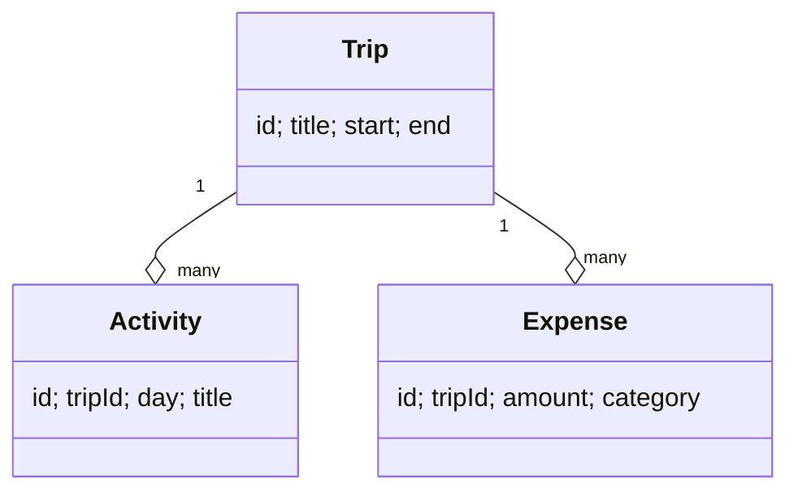

# Class dijagram – objašnjenje

U domeni postoje tri osnovne klase:
- **Trip** – jedno putovanje (id, naslov, početni i završni datum).
- **Activity** – pojedina aktivnost unutar putovanja (dan, naslov, vrijeme, bilješka).
- **Expense** – trošak unutar putovanja (iznos, kategorija, bilješka).

**Odnosi:**
- Jedan **Trip** ima **više** Activity zapisa (agregacija).
- Jedan **Trip** ima **više** Expense zapisa (agregacija).

Za prototip je dovoljno ovako jednostavno. U punoj verziji dodao bi se **User** (korisnik) i login, pa bi Trip pripadao korisniku.

---

