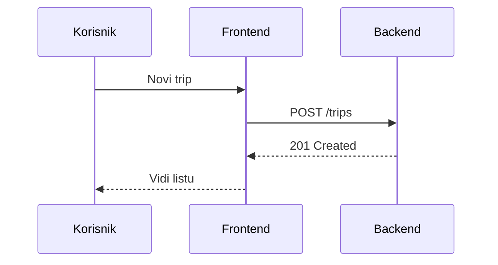

# Sequence – objašnjenje (kreiranje putovanja)

**Cilj:** korisnik želi stvoriti novo putovanje da bi kasnije dodavao aktivnosti i troškove.

**Koraci:**
1) Korisnik u pregledniku (frontend) upiše naziv i datume.
2) Frontend pošalje API-ju (backend) zahtjev **POST /trips** s tim podacima.
3) Backend kreira Trip zapis u memoriji i vraća ga natrag frontend-u.
4) Frontend osvježi listu i prikaže novo putovanje korisniku.

Isti obrazac vrijedi za dodavanje aktivnosti (POST /trips/:id/activities) i troškova (POST /trips/:id/expenses).

---

