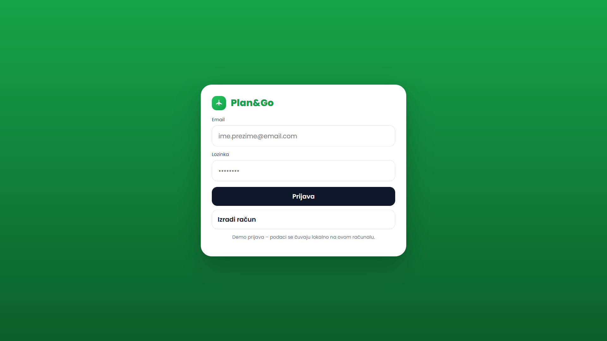
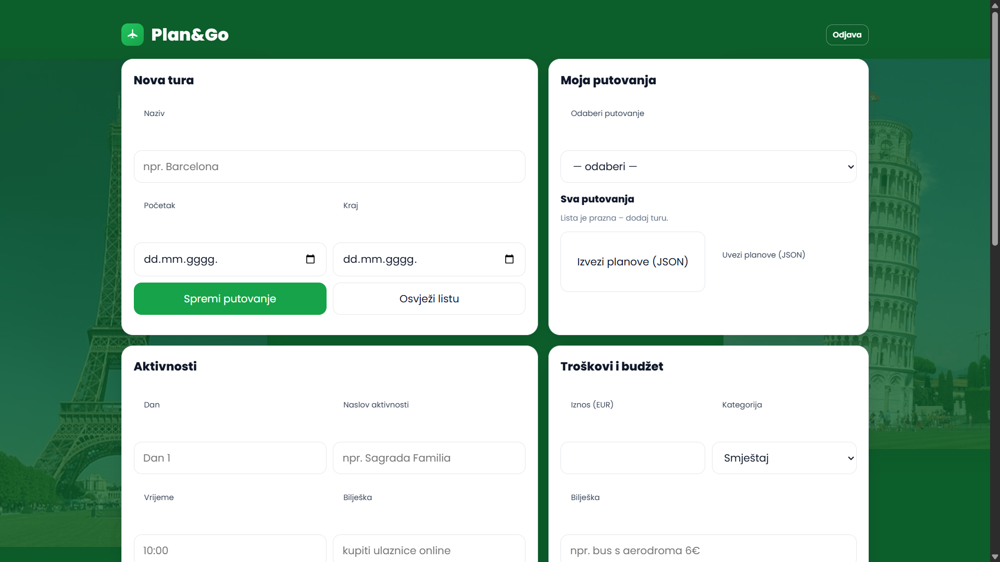
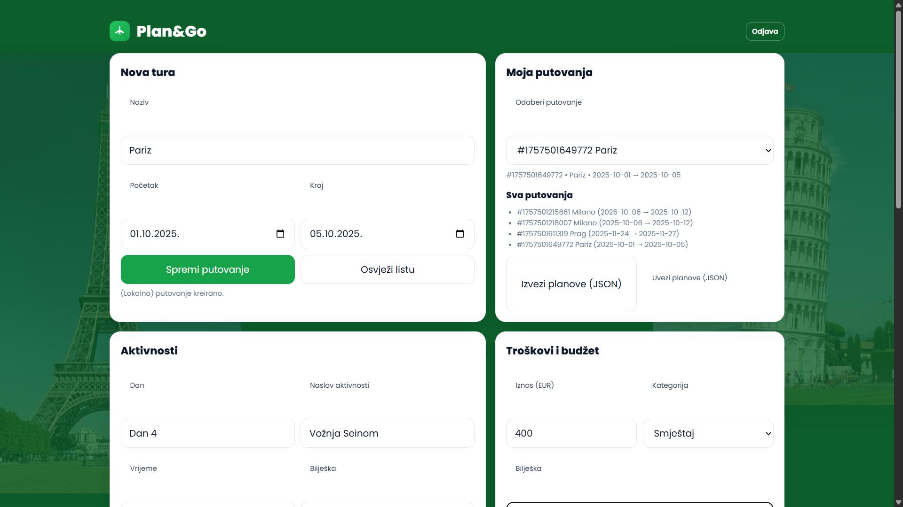
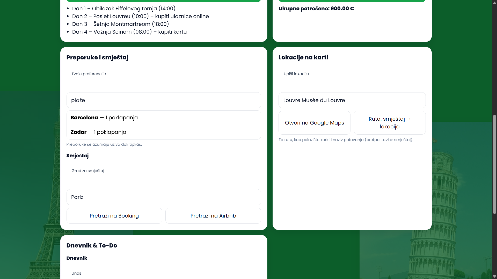
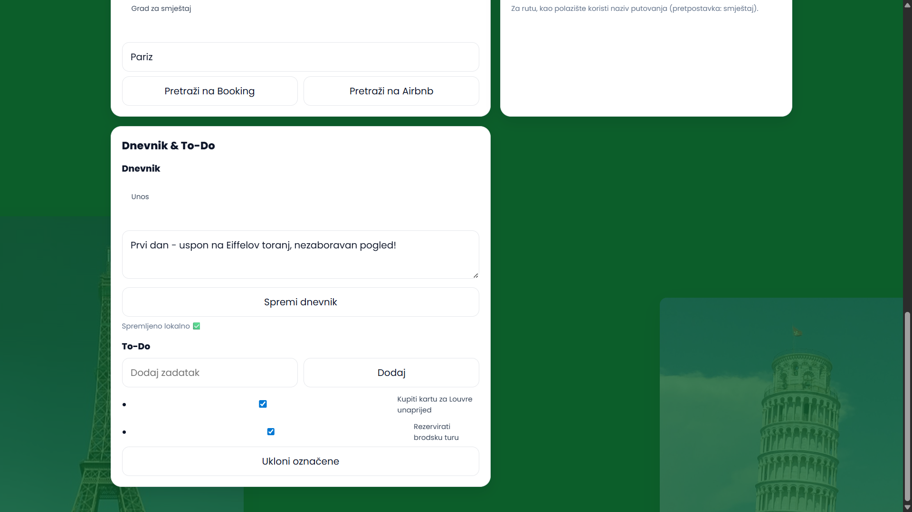

#Korisničke upute – Plan&Go

Pokretanje (lokalno)

1. Backend: otvoriti terminal, otići u app-backend, zatim npm install i npm start. Server radi na http://localhost:3000.

2. Frontend: otvoriti datoteku app-frontend/index.html u pregledniku (Chrome/Edge). Ako si mijenjala dizajn, napravi Ctrl + F5 (tvrdi refresh).

---

Prijava / Registracija

-Upiši email i lozinku i pritisni Prijava (ili Izradi račun).

-Sesija se pamti lokalno; gumb Odjava te vraća na login.

## Login ekran

---

Kreiranje putovanja

-U kartici Nova tura upiši Naziv i datume.

-Klikni Kreiraj putovanje.

-U padajućem izborniku Moja putovanja odaberi novo putovanje (prikazuje se sažetak).

## Glavni ekran

## Plan za Pariz

---

Aktivnosti po danima

-Odaberi putovanje u Moja putovanja.

-U kartici Aktivnosti upiši Dan, Naslov, Vrijeme i Bilješku.

-Klikni Dodaj aktivnost – pojavljuje se u listi.

---

Troškovi i budžet

-U kartici Troškovi upiši Iznos, izaberi Kategoriju i (po želji) Bilješku.

-Klikni Dodaj trošak – na vrhu se ažurira Ukupno potrošeno.

---

Preporuke destinacija

-Upiši preferencije (npr. “plaže”, “muzeji”, “noćni život”).

-Klikni Prikaži preporuke – dobit ćeš listu gradova.

-Klik na grad automatski postavlja taj grad za Booking/Airbnb pretragu.

## Preporuke

---

Smještaj (Booking/Airbnb)

-U kartici Smještaj klikni Pretraži na Booking ili Pretraži na Airbnb – otvori se tražilica s gradom i datumima iz odabranog putovanja.

---

Karte i rute (Google Maps)

-Otvori Pregled karte ili Ruta – koristi naslov putovanja kao polazište/odredište.

---

Dnevnik i To-Do (offline)

-Dnevnik: Upiši bilješke i klikni Spremi dnevnik.

-To-Do: Upiši zadatak → Dodaj; klik na zadatak označi/odznači; Ukloni označene briše sve označene.

## Dnevnik i To-Do

---

Izvoz / Uvoz plana (JSON)

-Izvoz: generira JSON datoteku s putovanjima (za dijeljenje).

-Uvoz: odaberi JSON datoteku i učitaj je natrag u aplikaciju.

---

Napomena o offline radu

-Ako backend nije dostupan, aplikacija i dalje radi lokalno (localStorage): dnevnik i to-do uvijek; putovanja/aktivnosti/troškovi imaju “fallback” lokalno.

---

Najčešće poruke

-“Prvo odaberi putovanje” – trebaš odabrati putovanje prije dodavanja aktivnosti/troška.

-“Ispuni sva polja” – provjeri jesu li polja popunjena.

-“Kreirano” – putovanje je uspješno dodano.

---

Savjeti

-Za najbolji dojam koristi Chrome/Edge i rezoluciju preko 1280 px.

-Ako ne vidiš slike (Eiffel/Pisa), provjeri da su u app-frontend/assets/ i da se zovu eiffel.jpeg i pisa.jpeg.

---